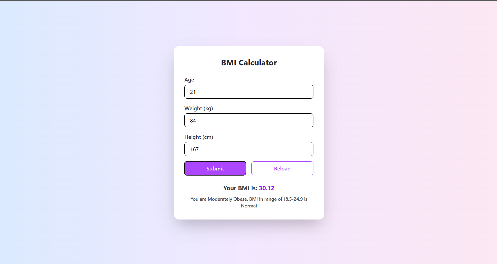

# BMI Calculator 🧮

A simple and responsive **BMI (Body Mass Index) Calculator** built with **React** and **Tailwind CSS**.
It helps users calculate their BMI based on age, weight, and height while providing feedback on their health status.

---

## 📷 Preview



## 🚀 Getting Started

### 1. Clone the repository

```bash
git clone https://github.com/Deyasin-Srijon/bmi-calculator.git
cd bmi-calculator
```

### 2. Install dependencies

```bash
npm install
```

### 3. Run the development server

```bash
npm run dev
```

Now open [http://localhost:5173](http://localhost:5173) in your browser.

---

## 🛠 Tech Stack

* **React** – For building UI components
* **Tailwind CSS** – For styling
* **Vite** – For fast bundling and development